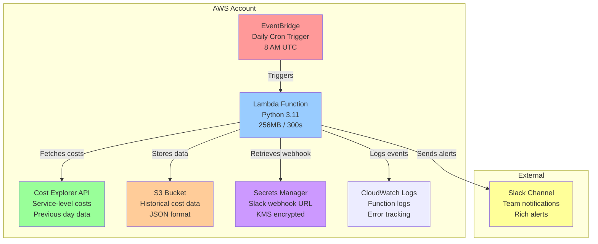
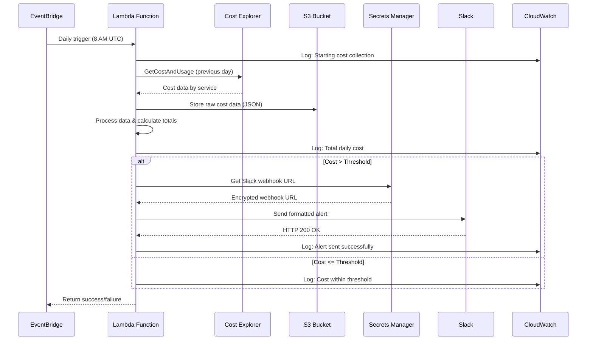
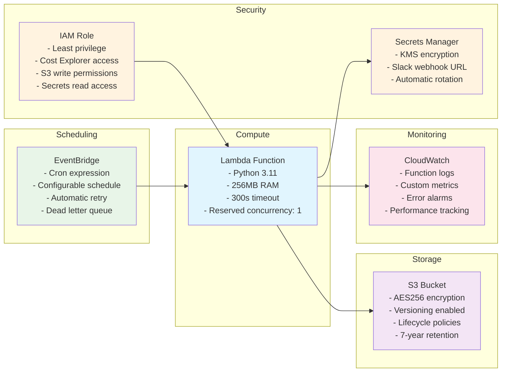
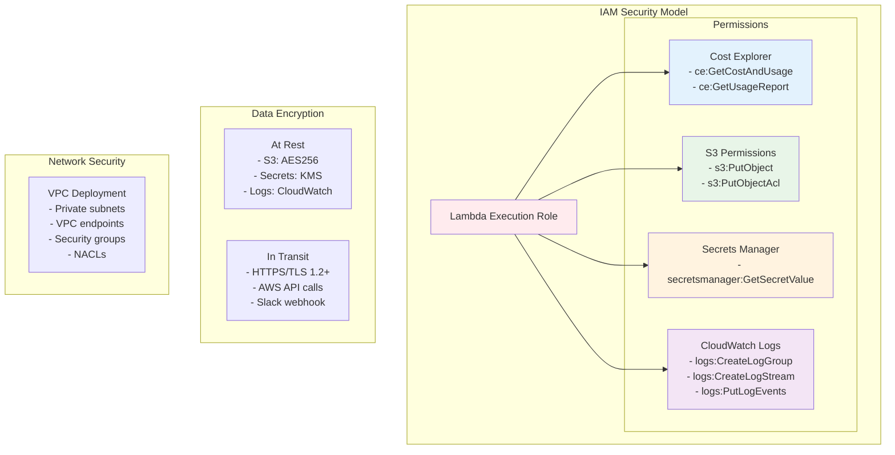
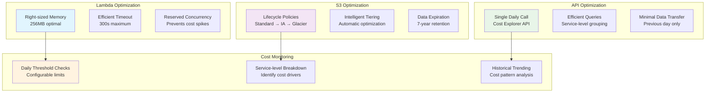
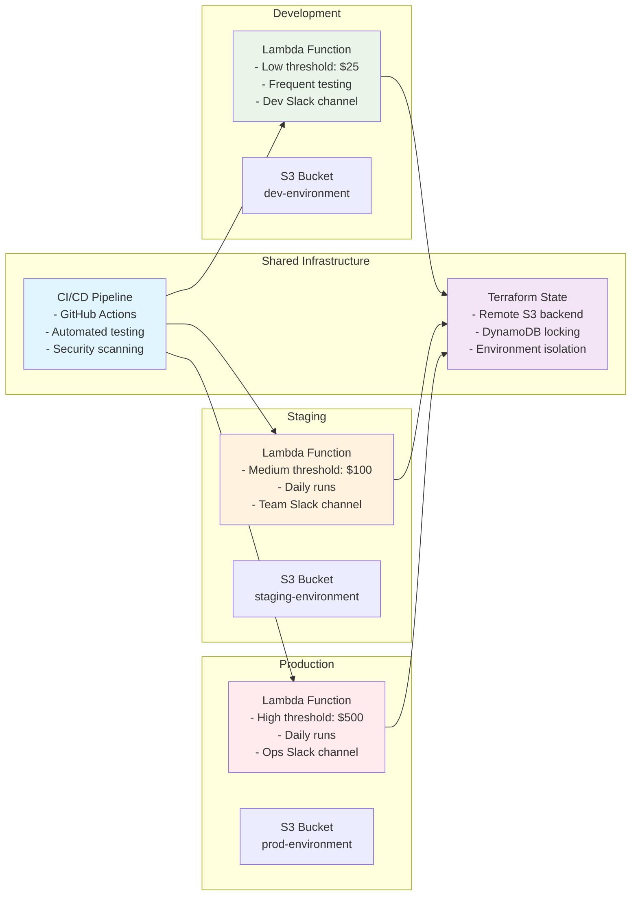
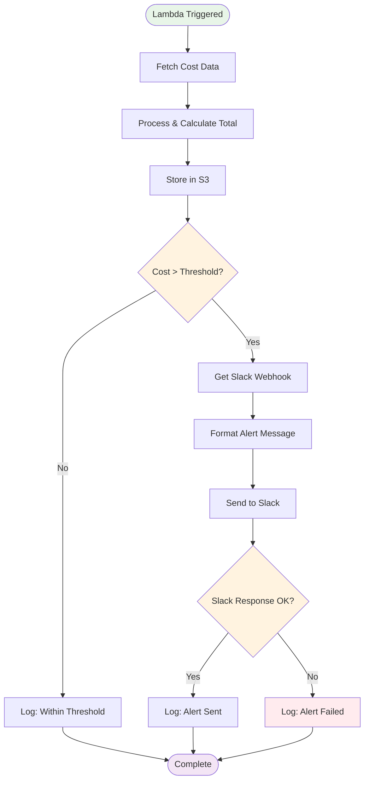
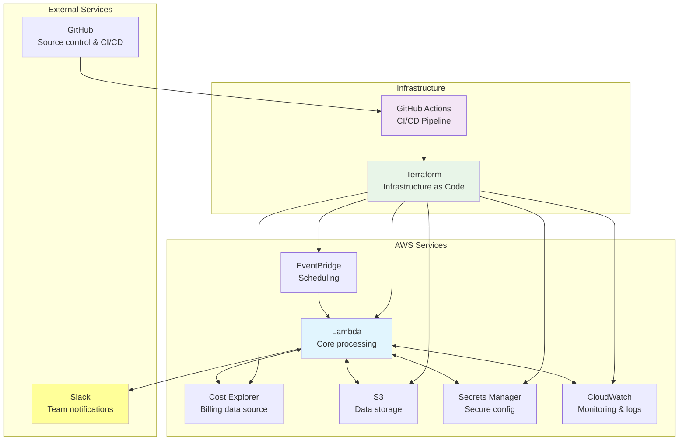

# AWS Cost Optimization Dashboard - Mermaid Diagrams

## System Architecture Flow

## Data Flow Sequence

## Infrastructure Components

## Security Architecture

## Cost Optimization Strategy

## Multi-Environment Deployment

## Alert Flow Decision Tree

## Integration Architecture

These diagrams provide multiple perspectives on the AWS Cost Optimization Dashboard architecture, from high-level system flow to detailed security and deployment strategies. They can be rendered directly in GitHub README files and documentation platforms that support Mermaid syntax.